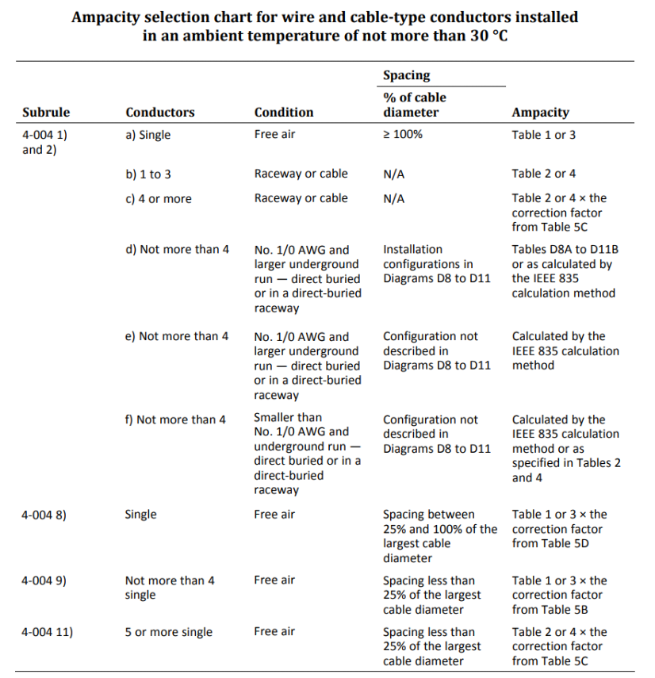
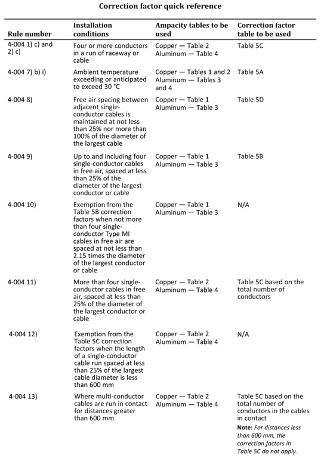

## Overview

The main area of concern for conductors is sizing. When properly sizing conductors, we consider the amount of power the load requires, then derate the cable accordingly. There are plenty of factors to consider for derating; such as ambient temperature, location, grouping, installation path, etc. This section will cover general methodology for each type of derating, as the ability to know which derating factors to apply is the main focus.

---
## Base Ampacity

At the elementary level, running conductors/cables through free air at 30°C, we use Tables 1/3 for single conductors and Tables 2/4 for 1-3 multi-conductor cables (or 1-3 single conductors in a raceway). Since many rules consider upsizing the cable according to a service factor, it is generally recommended to upsize 125% for most loads.

---
## Temperature Derating

All tables are calculated based on a 30°C ambient temperature, but cables can be exposed to higher temperatures. We use **Table 5A** to derate conductor ampacity where;

$$
\text{Conductor Ampacity}_{new} = \text{Conductor Ampacity}_{old} \times \text{Table 5A Factor}
$$

---
## Conduit Derating

Often conduits will house multiple conductors, which case, you would apply Table 5C factor to Table 2/4.

---
## Spacing Derating

Cables can be spaced in three ways based on the diameter of the largest cable in the group;

### Spacing <25% Diameter

For close spacing, it can be applied in two different way depending on the configuration, but some cases are defined to be functionally equivalent (FE) to each other. For 1-4 single conductors in free air, you would apply Table 5B factor to Table 1/3. Five or more single conductors in free air with close spacing is FE to 4 or more single conductors in a raceway/cable, where you would apply Table 5C factor to Table 2/4

### 25% Diameter < Spacing < 100% Diameter

This spacing is uncommon, but for single conductors in this configuration you would apply correction factor from Table 5D, according to Rule 4-004 8).

### Spacing >100% Diameter

When spacing is maintained at this distance, there is no derating factor applied.

---
## Parallel Runs & Direct Bury

Parallel runs and direct bury are generally for conductor sizes #1/0 AWG and larger. If buried, either directly buried in the ground or embedded conduit in concrete, we look to find the configuration in Diagrams D8-D11 and determine ampacity from their respective Tables D8A to D11A. For parallel single conductors in free air, it is advised to follow Figure B12-2, as these are standard configurations used.   

---
## Other considerations

In an industrial setting, cables can be exposed to many different things that affect its rating. For example, cables run underground must be wet rated, or if outside must be rated for sunlight exposure. Running equipment and cables in hazardous locations also affords its own considerations. Section 18 & Table 19 cover this area more in depth.

---
## General Methodology

To determine which derating factors to apply and their exceptions, the reference charts below can be used.

 

---
# Related Reading

Knowledge File — OESC: Section 4 Conductors  
Knowledge File — Conductor and Cable Derating
