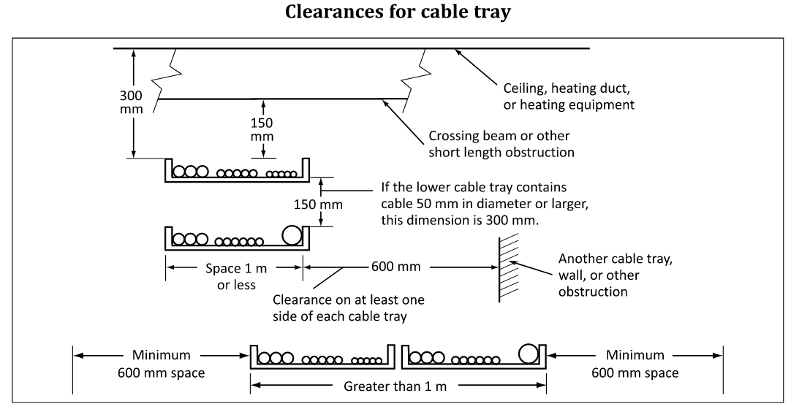

## Overview

Cable trays comprise a large portion of installation paths in industrial projects. They provide a large area to carry multiple conductors/cables while being less labour-intensive than conduit. This section will cover general characteristics, considerations, and some basic examples of filling/bending cable trays.

---

## Cable Tray Characteristics

There are multiple different configurations and types of cable trays, and plenty of components to go along with them,

### Material

Cable Trays can be made of; steel, aluminum, or fibreglass. Each have their on strengths and use cases. Typically, we focus on **galvanized steel** cable trays as they are the most common material type we deal with.

### Bottoms

The bottom of a cable tray decides the kind of installation path it is considered to be. There are; ladder (rung), solid, ventialted, wire mesh, etc., bottoms. We most often see **ladder trays** and they are considered *free-air* path of installation with no cover.

### Fittings

Fittings are the different kinds of trays that are used in project  such as straights, side 45s, vertical 90s, tees, etc. There are many different kinds, some of which are not common at all. During the routing phase, the design team will become familiar for choosing what to use, creating a BOM of all fittings used.

### Expansion

Like all metal materials, cable trays experience expansion and contraction during temperature fluctuations. Between two sections of cable tray an expansion joints/guides is used to handle this. Its calculation is dependant on the maximum temperature difference the sections are expected to experience.

### Typical Dimensions

Trays come in many different manufactured size. Heights, lengths, useable lengths, below is a typical [catalogue](https://tnb.ca/en/pdf-catalogues/cable-tray-systems/tnb-cable-tray/Aluminum_cable_tray.pdf) number for a straight piece.

---

## Clearances

The clearance for cable trays are mostly concerned

---

## Cable Tray fill

There is no regulation explicitly stating the allowable limit of a cable tray fill. A general rule of thumb is to allow for 40% at the start of the detailed design phase and 80% at the end, to accommodate unaccounted for loads, and changes during installation.

Cables Trays can be fitted with dividers, effectively dividing the area into smaller sections for multiple runs. This division **does not allow** us to mix HV and LV runs in the same tray. We usually lay cables at 100% spacing or 0% spacing for the duration of the run as either; single layer spaced or trefoil configuration.

---

## Appendix

### Related Knowledge Files

[Knowledge File: Electrical Cable Tray Basics](https://jnepeng.sharepoint.com/:b:/s/JNEElectricalPortalTeams/IQBtTHP_lg3JQJIxvLmY4aO0ASu8wD0xU1vlKVAghLyceGM?e=4hsiZl) 
[Knowledge File: Cable Tray Fill Calculations](https://jnepeng.sharepoint.com/:w:/s/JNEElectricalPortalTeams/IQDv0upg_n7VR6T_52A_DDI4Ae_oKjCl7_EWnXslImvY5HA?e=LyVdMO) 
Knowledge File Sharing Session: Cable Tray Supports

### Related OESC Rules

Rule 4-004 — Ampacity of Wires and Cables 
Rule 12-904 — Conductors in Raceway (Barrier Strips) 
Rule 12-2200 — Conductors/Cables installation methods (Clearances) 
Rule 12-2202 — Insulated Conductors/Cables in Cable trays 
Rule 12-2208 — Cable tray Bonding

### Related OESC Tables

Table 15 — Bending Radii: High-Voltage Cables
