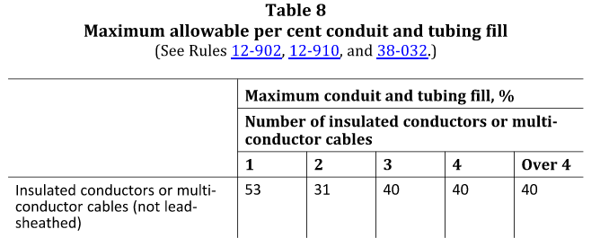
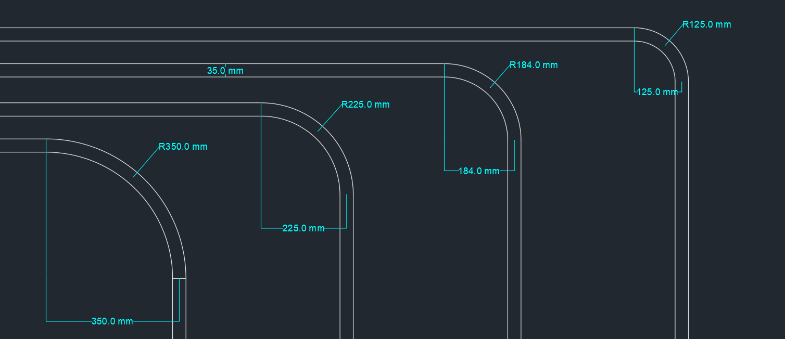

## Overview

Cables running through conduit provide a reliable path, protecting from environmental damages. As covered in the **Conductors** section and in Rules 4-004, cables must be derated accordingly if ran through conduit. Cable size is determined beforehand, based on load, distance, and it's installation path. Each cable size will be given by the manufacturer, as will the conduit's internal cross-sectional area, which determines our conduit fill schedule. This section will briefly cover the limits and methodology of filling conduits with conductors/cables.

---

## Cables in Conduit

Conduit fill percentage is determined by the number of cables/conductors inside. As per Figure 1 below, we are restricted to the following percentages. For most cases, we deal with a 40% fill limit. Simply put, we give conduit fill as a percentage of the total cable(s) area over internal conduit area.

There are a few factors to consider, such as pull tension, maximum of two 90° elbows in one run, etc. The larger concerns are maximum number of cables and voltage segregation.

- As per Rule 12-910, we are limited to a *maximum of 200 cables per conduit* no matter the size.
- It is best practice to segregate conduits by voltage, **never** mixing low voltage signal runs with high voltage power runs. You can have mixed runs, of 120V~600V in one conduit (usually if of the same circuit), but if feasible, it is best to separate voltages as much as possible.

---

## General Method

Once cables have been adequately sized, we must determine the best order to fill the conduits. We aim to fill conduits in order of; voltage level, and conductor gauge.

---

## Bend Radii

During the routing phase, the bending radius of the conduit is an important consideration. Conduits have a minimum bending radius to prevent excess pressure on the conduit wall, and to limit pulling tension. The bending radius depends on the diameter of the conduit, and the minimum radii can be found in Table 7. Below is a visualization of different bending radii of the same sized conduit.

As we see, the smaller the radius, the tighter the bend is. The third conduit is bent to the minimum allowewd radius, while the ones on the left show larger bending radii.

---

## Other considerations

Conductors and cables suitable for conduit are listed as raceway cables in Table 19. In an industrial setting, armoured cable is very common. While typically ran in cable trays, they are allowed to be run through conduit. According to Rule 12-902, we can run armoured cable if one of the two cases are true;

- the length of the cable being pulled into the conduit does not exceed the maximum pulling tension or maximum sidewall bearing pressure
- the maximum length between draw-in points is
  - 15m for a three-conductor copper cable;
  - 45m for a single-conductor copper cable;
  - 35m for a three-conductor aluminum cable; or
  - 100m for a single-conductor aluminum cable.

When running high current armoured or metal-sheathed conductors it can induced a voltage across the sheath. Moreover, when metal objects are placed inadvertently nearby or as grounding points, a current can travel in this circuit, posing a safety risk. To reduce this safety risk, it is typically recommended to use non-magnetic or non-magnetic box connectors, locknuts, bushings, and insulating plates that are at least 6mm thick to cover the opening in magnetic material if passing through.

---

## Appendix

### Related Knowledge Files

[Knowledge File: Maximum Allowable Conductors/Cables in Conduit and Tubing](https://jnepeng.sharepoint.com/:w:/s/JNEElectricalPortalTeams/IQD_dpZ_f5oHQ6fAWxmiT_CjAb57hCu7AJd_lmC_tLEvPTM?e=bzHXAI)

### Related OESC Rules

Rule 4-004 — Ampacity of Wires and Cables 
Rule 12-902 — Types of insulated conductors and cables 
Rule 12-904 — Conductors in Raceways 
Rule 12-910 — Conductors in Conduit

### Related OESC Tables

Table 7 — Minimum conduit bending radius 
Table 8 — Maximum allowable conduit fill percent 
Tables 9A-9G — Conduit areas at various percentages 
Table 19 — Conditions of use for Conductors and Cables
