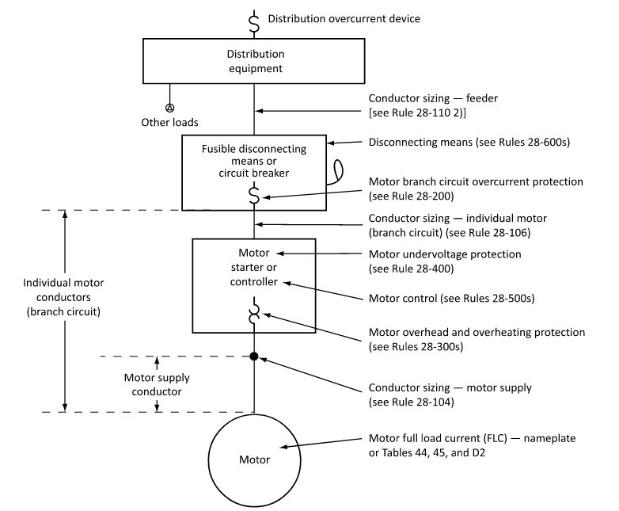
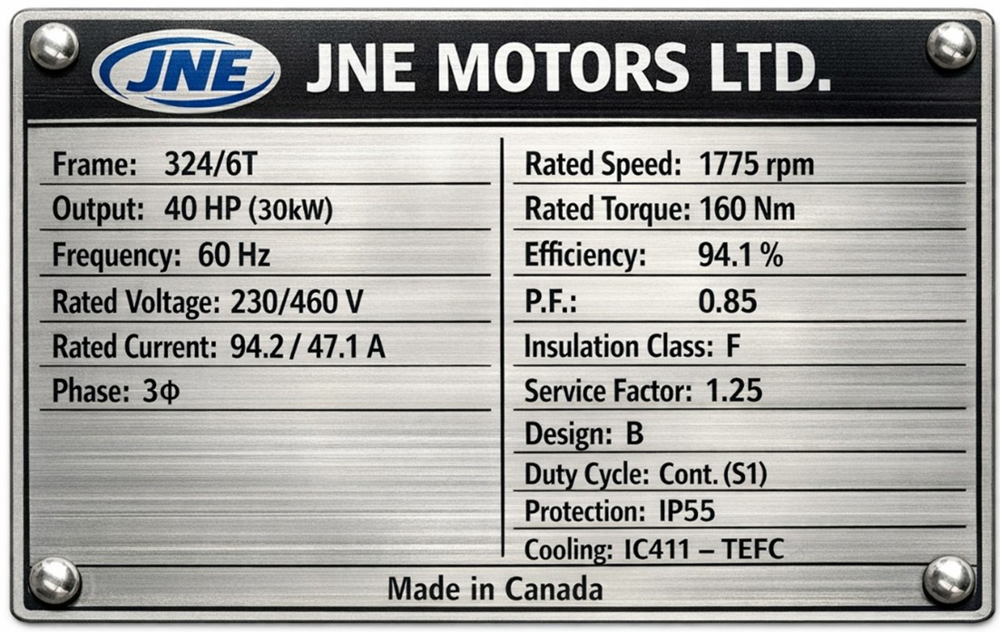

## Overview

Sizing motor feeders and branch-circuit conductors is crucial for any industrial application. This section covers key considerations and a practical sizing workflow under the National Electrical Code (NEC) 2026.

The first step when working with any motor is to gather nameplate and design criteria.

---

## Feeder Sizing

Under NEC 430.6(A)(1), conductor sizing and overcurrent protection calculations must be based on the Full-Load Current (FLC) values listed in the NEC tables (Table 430.247 for DC, Table 430.248 for 1φ AC, and Table 430.250 for 3φ AC), rather than the actual motor nameplate current rating. The motor nameplate FLA is used primarily for sizing motor overload protection (NEC 430.6(A)(2)).

To calculate the theoretical FLC for a 3φ motor for design checking:

$$
I_{\text{FLC}} = \frac{\text{HP} \cdot 745.7}{\sqrt3 \cdot V_{\text{LL}} \cdot \cos\theta \cdot  \eta}
$$

For actual installation compliance, the NEC standard Table FLC values must be used.

For a single motor branch circuit, NEC 430.22 requires that the conductors have an ampacity of not less than 125% of the motor FLC:

$$
I_{\text{conductor}} = 1.25 \cdot I_{\text{FLC}}
$$

For multiple motors on a single feeder, NEC 430.24 requires that feeder conductors have an ampacity of not less than 125% of the highest-rated motor FLC in the group, plus the sum of the FLC ratings of all other motors on the feeder.

---

## Conductor Temperature Ratings

Motors are often installed in hot or confined spaces, which requires ampacity adjustment. Under NEC 110.14(C)(1), conductor selection must respect termination temperature limits:
- Equipment rated 100 A or less, or marked for #14 AWG through #1 AWG, must use the **60°C column** of Table 310.16 unless the terminals are specifically listed and marked for 75°C.
- Equipment rated over 100 A, or marked for conductors larger than #1 AWG, uses the **75°C column** of Table 310.16.
- Class F and H motor windings can withstand high operating temperatures, but the connected supply conductors are still limited by terminal ratings (typically 75°C).

---

## Voltage Drop

NEC 210.19(A) Informational Note recommends sizing branch circuit conductors to limit voltage drop to not more than 3%, and a maximum of 5% total voltage drop for both the feeder and branch circuit combined, to ensure efficient equipment operation.

---

## Duty Cycle and Service Ratings

Not all motors are rated for continuous duty. Under NEC Table 430.22(E), branch-circuit conductors for short-time, intermittent, periodic or varying duty motors are sized on a percentage of the **nameplate current rating** rather than the table FLC. The percentage is selected using both the classification of service and the motor's time rating, and it can land above or below 100%. A 15-minute rated motor takes 120% under short-time duty and 85% under intermittent duty, so the classification has to be settled first.

This applies to the branch circuit. On the feeder side, NEC 430.24 Exception No. 1 permits smaller conductors where the maximum load determined from the sizes, number and duty of the motors supplied works out lower, which is an engineering determination rather than a table lookup.

---

## Multiple Motors Sizing Example

Sizing conductors for multiple motors on a single feeder is common. Apply the NEC 430.24 methodology to determine feeder conductor size.

Assume the following three motors are fed from a single 460V, 3-phase feeder:

| Motor No. | Size | Service Duty | FLC (from NEC Table 430.250, 460 V column) |
|-----------|------|--------------|------------------------------|
| $M_1$     | 5 HP  | Continuous   | 7.6 A                        |
| $M_2$     | 7½ HP | Continuous   | 11 A                         |
| $M_3$     | 3 HP  | Continuous   | 4.8 A                        |

The 125% is applied once, to the largest motor only; the remaining motors are counted at 100%.

| Term | Calculation | Contribution |
|-----------|--------------------------|-------------------------|
| $M_2$ (largest, at 125%) | 11 A × 1.25 | 13.75 A    |
| $M_1$ (at 100%)  | 7.6 A            | 7.60 A                  |
| $M_3$ (at 100%)  | 4.8 A            | 4.80 A                  |
| **Feeder Total**| **13.75 + 7.60 + 4.80** | **26.15 A**            |

### Feeder Conductor Selection:
Checking NEC Table 310.16 (under 60°C termination limits per NEC 110.14(C)(1) since target load is ≤100 A), we select **#10 AWG Copper** (rated for 30 A). #12 AWG is rated 20 A in the 60°C column, which is insufficient.

---

## Appendix

### Related Knowledge Files
<!-- 
[Design Basis — Calculations: Motor Feeder Sizing] 
[Knowledge File — NEC: Article 430 Motors, Motor Circuits, and Controllers] -->

### Related NEC Articles

Section 110.14(C) — Temperature Limitations of Terminals 
Section 210.19(A) — Voltage Drop Informational Note 
Section 430.6 — Ampacity and Motor Rating Determination 
Section 430.22 — Single Motor Conductor Sizing 
Section 430.24 — Several Motors Conductor Sizing 
Section 430.25 — Conductor Sizing for Feeder and Motor Loads

### Related NEC Tables

Table 310.16 — Ampacities of Insulated Conductors in Raceway or Cable 
Table 430.22(E) — Duty Cycle Conductor Percentages 
Table 430.247 — DC Motor Full-Load Current 
Table 430.248 — 1-Phase AC Motor FLC 
Table 430.250 — 3-Phase AC Motor FLC