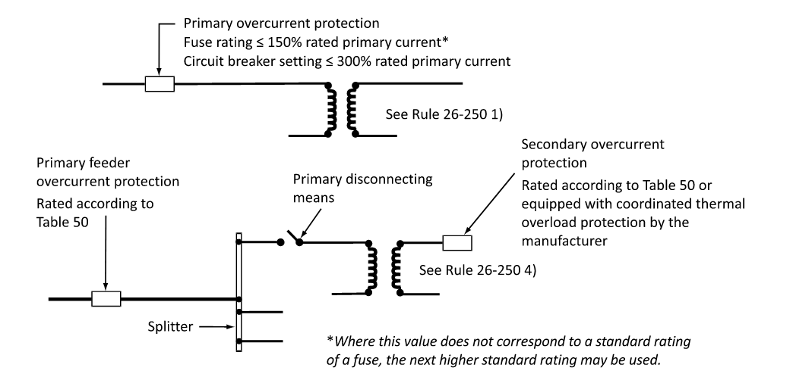
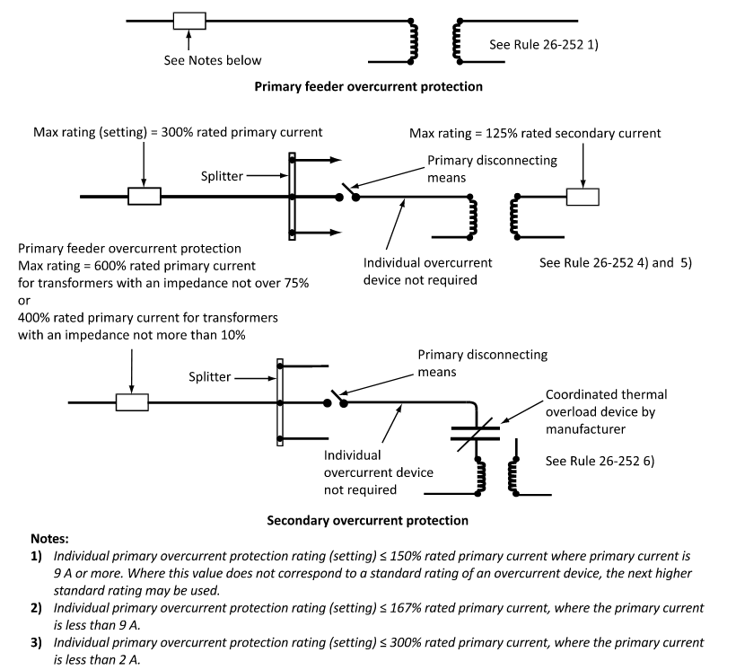

## Overview

The Transformer Protection section outlines the NEC design requirements and overcurrent protection limitations to safeguard transformers and their supply conductors. The NEC classifies transformers into two main voltage levels, each with its own overcurrent protective device (OCPD) sizing limits under **NEC 450.5**:

- Circuits rated over 1000 Volts
- Circuits rated 1000 Volts or Less

This section focuses on sizing fuses and circuit breakers to protect the transformer winding. Conductor and feeder sizing requirements are covered in the Transformer Feeders section.

---

## Transformer Circuit Classifications

### 1. Transformer Circuits Rated Over 1000 V

Each ungrounded conductor of a transformer feeder supplying a transformer rated over 1000V must be provided with overcurrent protection. Under **NEC Table 450.5(A)**, the maximum OCPD rating depends on three things: whether the installation is supervised, whether both primary and secondary protection are used, and the **transformer rated impedance**.

| Location | Rated impedance | Primary >1000 V CB | Primary >1000 V Fuse | Secondary >1000 V CB | Secondary >1000 V Fuse | Secondary ≤1000 V CB or Fuse |
|---|---|---|---|---|---|---|
| Any location | Not more than 6% | 600% | 300% | 300% | 250% | 125% |
| Any location | More than 6%, not more than 10% | 400% | 300% | 250% | 225% | 125% |
| Supervised only | Any (primary only) | 300% | 250% | Not required | Not required | Not required |
| Supervised only | Not more than 6% | 600% | 300% | 300% | 250% | 250% |
| Supervised only | More than 6%, not more than 10% | 400% | 300% | 250% | 225% | 250% |

Two points are easy to miss:

- **The secondary column is chosen by the secondary voltage.** A transformer with a 27.6 kV primary and a 600 V secondary is sized from the *Secondary 1000 Volts or Less* column, even though the primary side sits well above 1000 V.
- **A supervised location** is one where conditions of maintenance and supervision ensure that only qualified persons monitor and service the installation (Table 450.5(A), Note 3).

Note 1 permits a higher rating where the calculated value does not correspond to a standard one, and the device voltage decides which. At **1000 V and below** it is the next higher standard rating per 240.6. **Above 1000 V** it is the next higher *commercially available* rating or setting, since there is no 240.6 list to work from.

### 2. Transformer Circuits Rated 1000 V or Less

Under **NEC Table 450.5(B)**, overcurrent protection requirements for low-voltage transformers are based on the nominal full-load current (FLC):

**Primary-Only Protection (No Secondary OCPD):**

- Primary FLC of 9 A or more: Maximum **125%** of FLC. (Note 1 permits rounding up to the next standard OCPD rating per NEC 240.6(A)).
- Primary FLC less than 9 A: Maximum **167%** of FLC (No rounding up permitted).
- Primary FLC less than 2 A: Maximum **300%** of FLC (No rounding up permitted).

**Primary & Secondary Protection:**

- Primary FLC, any value: Maximum **250%** of FLC. (Rounding up is **not** permitted).
- Secondary FLC of 9 A or more: Maximum **125%** of FLC. (Note 1 permits rounding up to the next standard rating).
- Secondary FLC less than 9 A: Maximum **167%** of FLC (No rounding up permitted).

Note 1 of Table 450.5(B) is written against "125 percent of this current" only, so the round-up permission applies to the **125% cells alone**. Every other cell is a hard ceiling, and a calculated value falling between standard ratings has to be taken down to the next **lower** one.

---

## Key Design Considerations

### Continuous Circuit Loading

Under NEC 215.4(A)(1), transformer supply feeders must be sized for 125% of the continuous load. This thermal margin must be maintained to prevent conductor degradation.

### Fuses vs. Circuit Breakers

Circuit breakers are often specified for high-value industrial assets to prevent single-phase tripping (which can damage downstream three-phase motors). Fuses are cost-effective and offer exceptionally high short-circuit interrupting ratings. Standard ratings are defined in NEC 240.6(A).

<!-----

## Sizing Examples (Supervised Industrial Location)

These examples assume a standard indoor/outdoor industrial environment with copper conductors installed in raceways per Table 310.16.

### 1. Transformer Rated Over 1000 V

Consider an oil-filled transformer in a supervised industrial facility:

| Parameter         | Value             |
| ----------------- | ----------------- |
| Rating            | 2 MVA (2,000 kVA) |
| Primary Voltage   | 27.6 kV           |
| Secondary Voltage | 600 V             |
| Impedance         | 6%                |

**Full-Load Current Calculations:**

- Primary FLC:

$$ I_P = \frac{2{,}000 \times 10^3 \text{ VA}}{\sqrt{3} \times 27.6 \times 10^3 \text{ V}} \approx 41.84 \text{ A} $$

- Secondary FLC:

$$ I_S = \frac{2{,}000 \times 10^3 \text{ VA}}{\sqrt{3} \times 600 \text{ V}} \approx 1924.50 \text{ A} $$

**OCPD Sizing (Supervised, Primary & Secondary Protection, Table 450.5(A)):**

The rated impedance of 6% falls in the *Not more than 6%* row. The 27.6 kV primary uses the *over 1000 V* columns, while the 600 V secondary uses the *Secondary 1000 Volts or Less* column at **250%**. Watch this one, since the 300% figure alongside it applies only to secondaries above 1000 V.

- **Primary Fuses (300% max limit)**: $41.84\text{ A} \times 3.00 = 125.52\text{ A}$ $\Rightarrow$ next higher commercially available: **Select 150 A fuses**.
- **Primary Circuit Breaker (600% max limit)**: $41.84\text{ A} \times 6.00 = 251.04\text{ A}$ $\Rightarrow$ next higher commercially available: **Select a 300 A circuit breaker**.
- **Secondary Circuit Breaker (250% max limit)**: $1924.50\text{ A} \times 2.50 = 4811.25\text{ A}$ $\Rightarrow$ next higher standard rating per 240.6(A): **Select a 5000 A circuit breaker**.

---

### 2. Transformer Rated 1000 V or Less (Primary-Only Protection)

Consider a transformer with the following nameplate parameters:

| Parameter         | Value  |
| ----------------- | ------ |
| Rating            | 75 kVA |
| Primary Voltage   | 600 V  |
| Secondary Voltage | 208 V  |

**Full-Load Current Calculations:**

- Primary FLC:

$$ I_P = \frac{75{,}000 \text{ VA}}{\sqrt{3} \times 600 \text{ V}} \approx 72.17 \text{ A} $$

**Primary OCPD Sizing (Table 450.5(B) — Primary-Only, 125%):**

$$ I_{\text{target}} = 72.17 \text{ A} \times 1.25 = 90.21 \text{ A} $$

Under Table 450.5(B) Note 1, we round up to the next standard OCPD rating:

- **Select standard 100 A fuse or circuit breaker**

---

### 3. Transformer Rated 1000 V or Less (Primary & Secondary Protection)

Consider a dry-type transformer with the following nameplate parameters:

| Parameter         | Value  |
| ----------------- | ------ |
| Rating            | 75 kVA |
| Primary Voltage   | 600 V  |
| Secondary Voltage | 208 V  |

**Full-Load Current Calculations:**

- Primary FLC: $I_P \approx 72.17\text{ A}$
- Secondary FLC:

$$ I_S = \frac{75{,}000 \text{ VA}}{\sqrt{3} \times 208 \text{ V}} \approx 208.18 \text{ A} $$

**OCPD Sizing (Table 450.5(B) — Primary and Secondary Protection):**

- **Primary OCPD (250% limit - Rounding Up NOT Permitted)**: 

$$ I_{\text{pri, max}} = 72.17 \text{ A} \times 2.50 = 180.43 \text{ A} $$

Since rounding up is not permitted above 250%, we must round down to the next standard rating:

- **Select standard 175 A fuse or circuit breaker**

- **Secondary OCPD (125% limit - Rounding Up Permitted)**:

$$ I_{\text{sec, max}} = 208.18 \text{ A} \times 1.25 = 260.23 \text{ A} $$

Since rounding up is permitted for the 125% secondary limit, we round up to the next standard rating:

- **Select standard 300 A fuse or circuit breaker**

---

## Conclusion

Based on the calculated nominal FLCs and standard NEC rules, the required overcurrent protection device sizes are:

**2 MVA, 27.6 kV / 600 V, Supervised, Both Sides Protected Transformer**

- Primary: 150 A fuses or 300 A circuit breaker
- Secondary: 5000 A circuit breaker

**75 kVA, 600 V / 208 V, Low-Voltage Primary-Only Protected Transformer**

- Primary: 100 A rated fuse or circuit breaker

**75 kVA, 600 V / 208 V, Dry-Type, Both Sides Protected Transformer**

- Primary: 175 A rated fuse or circuit breaker
- Secondary: 300 A rated fuse or circuit breaker -->

---

## Appendix

<!-- ### Related Knowledge Files

[Knowledge File — NEC: Article 450 Transformers and Transformer Vaults] 
[Design Basis — Calculations: Transformer Protection Calculation] -->

### Related NEC Articles

Section 240.6 — Standard Overcurrent Device Ratings 
Section 450.5 — Overcurrent Protection of Transformers

### Related NEC Tables

Table 450.5(A) — Overcurrent Protection for Transformers Over 1000 Volts 
Table 450.5(B) — Overcurrent Protection for Transformers 1000 Volts and Less
