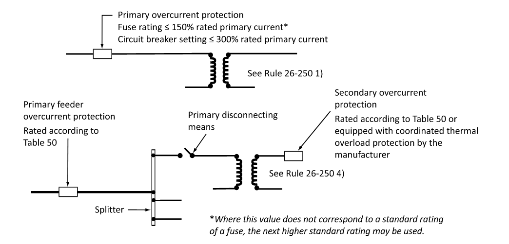
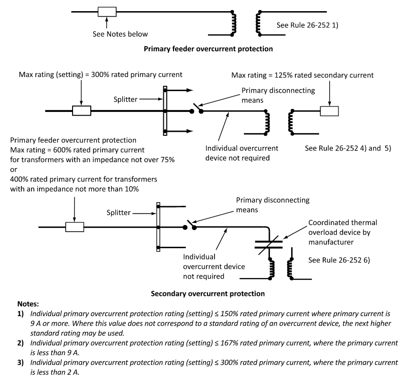
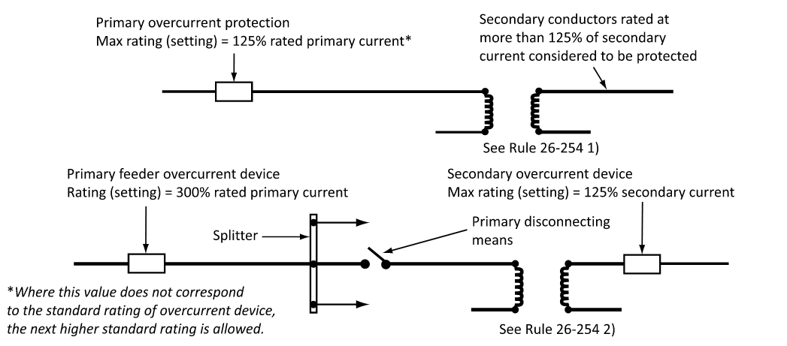

## Overview

The Transformer Protection section describes the OESC intent and design principles for overcurrent protection to maintain operability of a typical transformer. The OESC classifies three main groups of transformer circuits, each with its own associated design rules. This section focuses on the sizing of the fuses and breakers used to protect the transformer, cable sizing can be found in the Transformer Feeders section.

---

## Transformer Circuit Classifications

There are 3 main types of transformer circuits outlined in OESC Section 26-250, 26-252, and 26-254:

- Circuits rated over 750 V
- Circuits rated 750 V or less, other than dry-type transformers
- Dry-type transformer circuits rated 750 V or less

Circuits over 750 V are treated as high-voltage systems; at this level, arc-flash energy, insulation stress, and fault consequences increase significantly. The focus with these systems is on safety rather than equipment convenience. Non-dry type transformers at low voltage pose a fire and environmental risk due to the presence of insulating liquid, therefore we must account for leakage, ignition, and heat dissipation. Finally, dry type transformers at low voltages pose the lowest overall risk with risks being primarily electrical rather than fire-related. When considering the application of the transformer and which type of cooling it will use there are two main options:

- 1. Oil-Cooled Transformers (Rules 26-250 & 26-252):
  - Typically used in either outdoor or higher voltage systems due to being fully enclosed alongside better cooling capabilities
  - Higher cost and require additional maintenance
- 2. Dry-type Transformers (Rule 26-254):
  - Common in indoor and lower voltage applications
  - Require less maintenance and are often cheaper
  - Lower capacity due to inferior heat dissipation with respect to oil-cooled systems

### Transformer Circuits Rated Over 750 V

Each ungrounded conductor of the transformer feeder or branch circuit supplying the transformer shall be provided with overcurrent protection:

- a) rated at **not more than 150%** of the rated primary current of the transformer in the case of fuses; and
- b) rated or set at **not more than 300%** of the rated primary current of the transformer in the case of breakers.

The OESC outlines some exceptions to this rule in subrules 2-4 of section 26-250.

### Non-Dry Type Transformer Circuits Rated Under 750 V

Each ungrounded conductor of the transformer feeder or branch circuit supplying the transformer shall be provided with overcurrent protection rated or set at **not more than 150%** of the rated primary current of the transformer.  As low-voltage transformers, as a general rule, we allow the following protection on the primary side;

- Where the primary current is 9A or more, the multiplier is 150%
- Where the primary current is less than 9A, the multiplier is 167%
- Where the rated primary current is less than 2A, the multiplier is 300%

The OESC further outlines some exceptions to this rule in subrules 2-6 of section 26-252.

### Dry Type Transformer Circuits Rated Under 750 V

Each ungrounded conductor of the transformer feeder or branch circuit supplying the transformer shall be provided with overcurrent protection rated or set at **not more than 125%** of the rated primary current of the transformer, and this primary overcurrent device shall be considered as protecting secondary conductors rated at **not less than 125%** of the rated secondary current. The OESC outlines an exception to this rule in subrules 2-3 of section 26-254.

---

## Considerations

There are a few things that must be accounted for when dealing with transformer protection. During the design phase, things such as transformer size and overcurrent device size will be calculated.

### Maximum Circuit Loading

OESC Section 8-104 states that the ampere rating of a consumer's service, feeder, or branch circuit shall be the lesser of the rating of the overcurrent device protecting the circuit or the ampacity of the conductors. It also says that the calculated load in a circuit shall not exceed the ampere rating of the circuit. The calculated load in a consumer's service, feeder, or branch circuit shall be considered a continuous load unless it can be shown that in normal operation it will not persist for:

- a) a total of more than 1 hour in any 2 hour period if the load does not exceed 225 A; or
- b) a total of more than 3 hours in any 6 hour period if the load exceeds 225 A.

### Fuses vs Breakers

While creating the design, the engineer should consider the cost comparisons, availability of units, the total load size, and what the devices are protecting. Circuit breakers are typically used on higher value assets for tighter regulation and to prevent one phase tripping which may happen with fuses. Fuses are often less expensive and used for lower voltage or remote applications of transformers. A list of common/standard fuse sizes can be found in Table 13.

### Transformer Connection Types

Another thing to consider is how the transformer windings are configured. Typically you will see the Delta-Wye connection as it is commonly used in low power distribution; the Delta windings provide a balanced load for the utility company while the Wye connection provides a 4th-wire neutral connection for the secondary side. The designer should also consider how the secondary side will be grounded (Open, Solid Ground, or Neutral Ground Resistor).

---

## Appendix

### Related Knowledge Files

[Knowledge File — OESC: Section 26 Installation of Electrical Equipment](https://jnepeng.sharepoint.com/:b:/s/JNEElectricalPortalTeams/IQAr5W2CWdUbQb-26XCqmNYqAfifLPPITzkxySXkq7Q7sGQ?e=ZFTBIb) 
[Design Basis — Calculations: Transformer Protection Calculation](https://jnepeng.sharepoint.com/:w:/s/JNEElectricalPortalTeams/IQDKl-wkmkujQb_ZfZKZZwfDAXYYVGNWrV_TkJmXlw8w2Ac?e=BAApqB)

### Related OESC Rules

Rule 8-104 — Maximum circuit loading 
Rule 26-250 — Overcurrent protection, transformers rated >750 V 
Rule 26-252 — Overcurrent protection, transformers rated <750 V, other than dry type 
Rule 26-254 — Overcurrent protection. dry-type transformers rated <750 V

### Related OESC Tables

Table 13 — Standard Overcurrent Device Ratings 
Table 50 — Overcurrent protection, transformers rated > 750V
