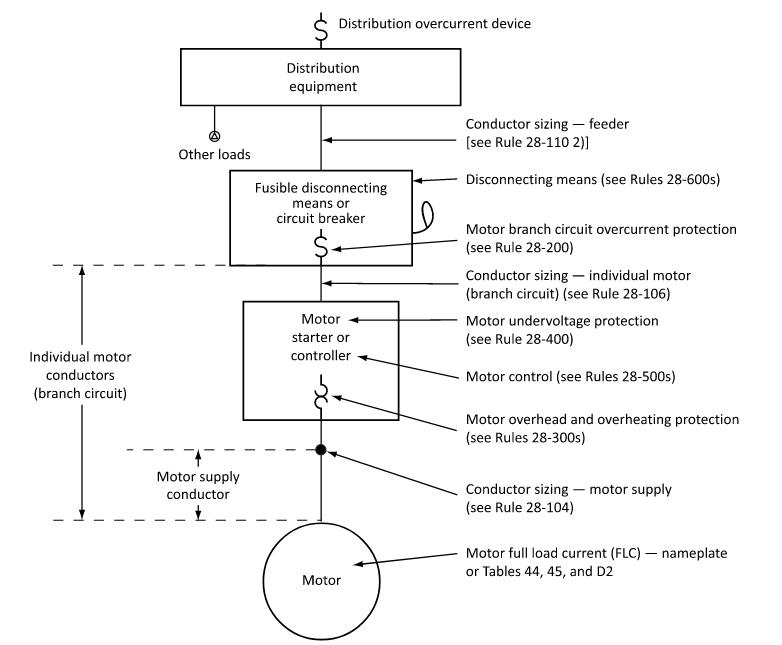
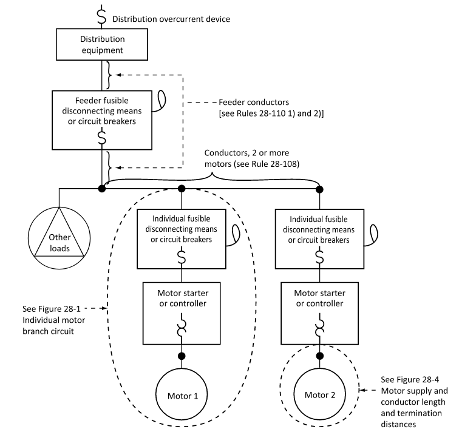

<!-- # Motor Feeders -->
## Overview
Sizing feeders for motors is crucial for any application in an industrial setting. A few preceeding topics are relevant to this area such as conductor sizing & voltage drop. This section will cover some other important considerations and provide a practical workflow. Below is a diagram that covers a general single motor circuit.

The first step for working with any motor is to gather all information available about the motor. This is usually found on the motor itself on it's nameplate, or consulting the manufacturer for the datasheet. A typical motor nameplate can be seen below.

---
## Feeder Size
Feeder size is based on the motor's Full Load Ampacity (FLA), and is typically found on the nameplate. If unavailable, we can find it's FLA from the following equation, or from Tables 44, 45, or D2. To calculate the FLA for a 3Φ motor we use the following equation:

$$
I_{\text{FLA}} = \frac{\text{HP} \cdot 745.7}{\sqrt3 \cdot V_{\text{LL}} \cdot \cos\theta \cdot  \eta}
$$

##### Where
- $\mathbf{I_L}$ = Line current, A
- **HP** = Horsepower rating, HP
- $\mathbf{V}_{\text{LL}}$ = Line voltage, V  
- $\mathbf{cos\theta}$ = Power factor
- $\mathbf{\eta}$= Efficiency, %

Generally, the feeder size will be determined by the FLA, the duty cycle, and the service factor. According to OESC Rule 28-106 the feeder size shall be not less than:

$$
I_L = 1.25 \cdot I_{FLA}
$$

---
## Feeder Temperature Ratings
The application of many motors require them to be in confined spaces, exposed to high ambient temperatures, and even hazardous locations, therefore they must be adequately derated. Usually we consider an insulation temperature rating of 60°C for loads of <100 A, however we must check the motors names against Table 37 to find its adequate temperature rating. The above nameplate example would need 90°C rating based on its nameplate ratings.

---
## Voltage Drop
Most motors will be fed from a branch circuit. According to OESC Rule 8-102 we are limited to a maximum 3% voltage drop, so conductors must be sized and derated accordingly.

---
## Other derating and considerations
Another important consideration is the service rating of motors. Not all motors will be running continuously, some will have intermittent services duties. Acccording to OESC Rule 28-108, we consider the different duty factors for different service duties, which can be found in Table 27.

---
## Multiple motors

Working with multiple motors is often found. While this increases complexity, applying the same methodology to each motor can simplify things. Say you have three motors, with the following characteristics.

| Motor No. | Duty Service | FLA |
|-----------|--------------|-----|
| $${M_1}$$ | Continuous    | 9   |
| $${M_2}$$ | Continuous    | 12  |
| $${M_3}$$ | Non-continuous, 15min. rating    | 5   |

We only upsize the largest continuous FLA motor and apply the applicable factors for the non-continuous motors, resulting in

| Motor No. | Adjusted FLA | Minimum Conductor Size |
|-----------|--------------|------------------------|
| $${M_1}$$ | 9 X 1.25 = 11.25    | No. 14 AWG |
| $${M_2}$$ | 12 x 1.25 = 15   | No. 14 AWG |
| $${M_3}$$ | 5 x 1.2 =  6 | No. 14 AWG |
| Feeder Total | 9 + 15 + 6 = 30 | <mark> No. 10 AWG <mark> |

---

# Appendix

## Related Knowledge File

[Design Basis – Calculations: Motor Feeder]()

[Knowledge File – OESC: Section 28 Motor and Generators]()

## Related OESC Rules

Rule 4-004 — Conductor ampacity

Rule 4-006 — Temperature limitations

Rule 8-102 — Voltage drop 

Rule 28-104 — Motor supply conductor insulation temperature rating & ampacity

Rule 28-106 — Conductor sizing:  Single motor branch circuit

Rule 28-108 — Conductor sizing:  Multiple motors branch circuit

Rule 28-110 — Conudctor sizing: Feeder 

Rule 28-400 — Motor Undervoltage

## Related OESC Tables

Tables 27 — Motor Service Duties

Tables 37 — Motor Insulation Class Rating

Table D2 — DC motor Full Load Ampacity

Table 44 — 3Φ Motor FLA at 100% PF

Table 45 — 1Φ Motor FLA at 100% PF

<!--
**************************Look to add flowchart for methodology once everything has been checked and references are good*******************************
-->

