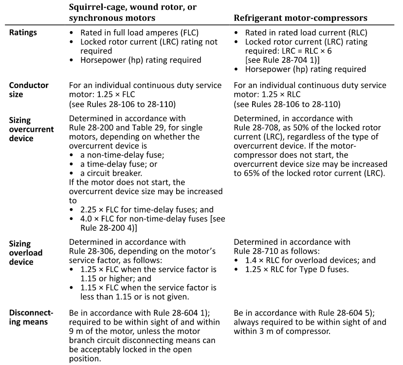

## Overview

Once motor feeder size has been determined, our next step is the selection of motor protection devices. Motor protection consists of three primary functions:

- Overcurrent protection
- Overload and overheating protection
- Disconnecting means

---
## Overcurrent Devices

When motors start, they pull a large inrush current, typically six times the Full Load Current (FLC). Determining the adequate fuse size and type can help avoid nuisance tripping. The most common devices used are;
- Time-delay fuses
- Non-time-delay fuses
- Inverse-time (thermal-magnetic) circuit breakers, and 
- instantaneous (magnetic-only) circuit breakers. 

As per Rules 28-200 & 28-204, we generally size overcurrent device by Table 29 (and Table D16 which is based on Table 29), selecting the closest standard fuse size not exceeding the calcualted value. A list of common/standard fuse sizes can be found in Table 13.

Below is a general flow to follow for sizing overcurrent devices based on available information. Note that for **any type of motor** protected by an **instantaneous trip** circuit breaker, the size must be circuit breaker must be sized to either the FLC by 1300% or Locked Rotor Current (LRC) by 215%.

<!-- FLOWCHART_MOTOR_PROTECTION -->

For sizing the overcurrent device for a feeder supplying multiple motors, the methodology is similar to sizing feeders for mutiple motors. You adjust the largest FLC accordingly to Table 29, then add the remaining nominal FLCs to size the main feeder. 

For example, say you have three motors, with the following characteristics

| Motor No. | Fuse Type  | FLC |
|-----------|------------|-----|
| $${M_1}$$ | Time-delay | 62  |
| $${M_2}$$ | Time-delay | 27  |
| $${M_3}$$ | Time-delay | 11  |

To size each motor's overcurrent device, we would apply the factor from Table 29 for each line.

| Motor No. | Ampere Target| Standard Fuse Rating |
|-----------|--------------|---------------------|
| $${M_1}$$ | 62 $$\cdot$$ 1.75 = 108.5 A | 100 A |
| $${M_2}$$ | 27 $$\cdot$$ 1.75 = 47.25 A | 45 A  |
| $${M_3}$$ | 11 $$\cdot$$ 1.75 = 19.25 A | 15 A  |

To size the feeder supplying all these motors, we adjust the largest FLC in the circuit, and add the remaining FLCs to size our overcurrent device.

| Device Type | Ampere Target| Standard Fuse Rating |
|-------------|--------------|---------------------|
| Non-time-delay fuse | (62 $$\cdot$$ 3) + 27 + 11 = 224 A | 200 A |
| Time-delay fuse | (62 $$\cdot$$ 1.75) + 27 + 11 = 146.5 A | 125 A |
| Circuit Breaker | (62 $$\cdot$$ 2.5) + 27 + 11 = 193 A | 175 A |
---
## Overload & Overheating Protection

Overloading and overheating protection is intended to protect the motor from things such as sustained overload and excessive heating, these devices respond to current over time and are normally integrated into the starter or controller.  As seperate devices, they are sized according to motor's nameplate current rating. In general, if the service rating is greater than 1.15 then size by a factor 1.25, otherwise size by factor of 1.15. Consult Table 25 for the number of and where to places devices based on the system.

---
## Control & Starters

All motors require starters/controllers, they must be of the correct rating in HP equal or greater than the motor itself.

---
## Disconnecting Means

The rules generally cover different situations and cases where starters and disconnects are used interchangeably, e.g. using a starter as a the sole  disconnect if the situation meets a certain criteria. In general it is best to have a dedicated disconnect for each motor/motor group. 

Location is the main focus, when typically placed at the distribution centre, they can serve as the main source of de-energizing the circuit when; 
- within sight of, and 9 metres of the motor or machinery driven by the motor, or
- be able to be locked in the open position and is labelled with the loads connected to it.

<!--
## Motor not starting

As we saw in the first section, we aim to chose a fuse size as close as we can to the adjusted FLC. Sometimes we are limited to standard fuse sizes which could be well below this target, which might not allow our motor to start. Furthermore, all these calculations are based on the assumption that not all the motors will be starting simultaneously. Though typically in the past 15 years, most industrial motors come with soft starters of VFds, so motor not starting due to nuissance tripping is not as big of a concern anymore.
-->
---
## General rules
As a general rule of thumb, we can follow Figure 1 below as a quick guide to choosing devices for different motors. 

<!--
## Special motors
RLC for compressors
-->

---
## Appendix

### Related Knowledge File

[Knowledge File - OESC: Section 28 Motor and Generators]()

### Related OESC Rules

Rule 28-200 — Branch circuit overcurrent protection 
Rule 28-202 — Feeder circuit overcurrent protection 
Rule 28-210 — Instantaneous-trip circuit breakers 
Rule 28-306 — Trip selection of overload devices 
Rule 28-604 — Location of disconnecting means 

### Related OESC Tables

Table 13 — Overcurrent devices; conductor protection 
Table 29 — Overcurrent devices; motor branch circuits 
Table 25 — Overcurrent devices; trip coils for motors 
Table D16 — Conductors, fuses, circuit breakers for motor overload and overcurrent protection
